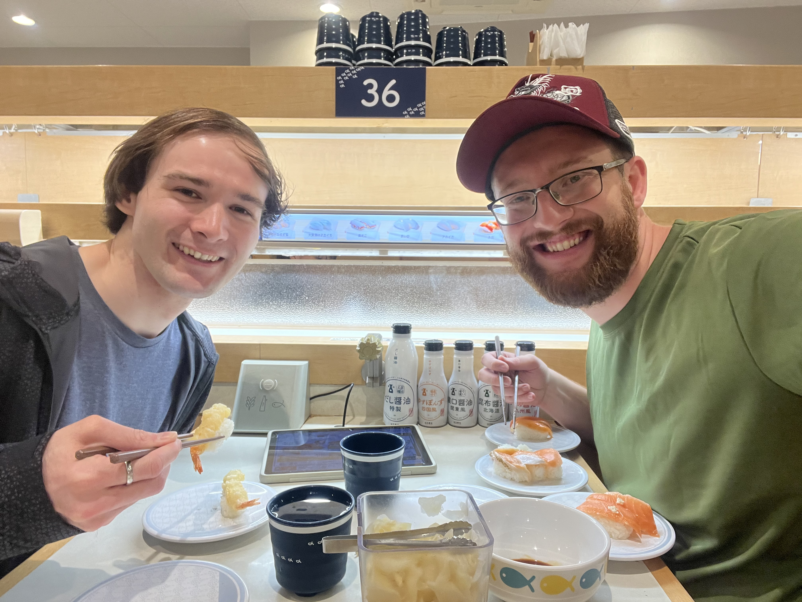

I landed in Tokyo at the Hanada airport at about 3 p.m., and went straight to Ricoland store in Tokyo Bay for some motorcycle gear shopping! There are some high quality brands in Japan that you can’t buy in America for the same price, so I definitely took advantage of that. I bought a motorcycle bag, a good warm weather jacket, some boots, and some gloves. I’m so excited to try them out! I’m still planning on a motorcycle ride on Monday, so they’re going to be used very soon. It seems appropriate that their maiden voyage will be in the land of the rising sun. 

After buying the gear, I met up with Justin, my good friend from California. It was great catching up with him. We haven’t seen each other in over a year, since I moved away from California. He’s doing a study abroad in Tokyo and is taking classes in Japanese, which is impressive! I really want to learn Japanese, but I haven’t put in the time and energy.

When we met up, he took me to some much needed conveyor belt sushi. It was an amazing first meal in Japan. I hadn’t eaten non-airport food for about a day at that point, so it was very much appreciated! I absolutely love the conveyor belt sushi - you can eat exactly as much as you want without wasting anything. And I took full advantage of the it, particularly the salmon.

